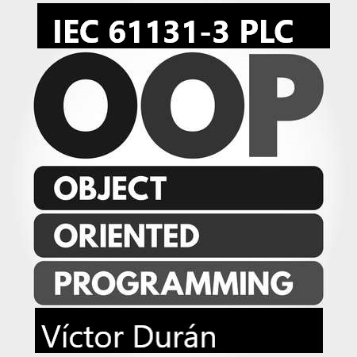

<span style="color:green"><font size="5">
📖 Curso Programación Orientada a Objetos Youtube -- OOP :
</font></span>


<span style="color:green"><font size="3">
by Runtimevic -- Víctor Durán Muñoz.
</font></span>
***
<p align="center"><span style="color:grey"><font size="5">
. ¿ Qué es OOP?
</font></span>

<span style="color:grey"><font size="5">
. ¿ Qué es OOP?
</font></span>

- Es un paradigma que hace uso de los objetos para la construcción de los software. 

    . ¿ Qué es un paradigma?
    - Tiene diferentes interpretaciones, puede ser un **modelo**, **ejemplo** o **patrón.**
    - Es una **forma** o un **estilo** de programar.
- se busca plasmar la realidad hacia el código.

<span style="color:grey"><font size="4">
. ¿Cómo pensar en Objetos?
</font></span>

- Enfocarse en **algo de la realidad.**
- Detalla sus **atributos, (propiedades)**
- Detalla sus **comportamientos (metodos)**

```text
Ejemplo: (telefono móvil-smartphone)
. ¿Qué atributos reconocemos? (Propiedades)
    - color.
    - marca.
. ¿Qué se puede hacer? (Metodos)
    - Realizar llamadas.
    - Navegar por internet. 
```
***
<span style="color:grey"><font size="4">
. Tipos de paradigmas:
</font></span>

- Imperativa -- (**Instrucciones a seguir** para dar solución a un problema).
- Declarativa -- (Se **enfoca en el problema** a solucionar).
- Estructurada -- (La solución a un problema sigue **una secuencia de inico a fin**).
- <span style="color:yellow"><font size="3"> Orientada a objetos (Construye soluciones **basadas en objetos**).
</font></span>
- Funcional -- (Divide el problema en diversas soluciones que serán ejecutadas por las **funciones declaradas**).
***
<span style="color:grey"><font size="4">
. Clases y Objetos:
</font></span>

- Una Clase es una **plantilla**.
- Un Objeto es la **instancia de una Clase**.
    
<p align="center">


***
<span style="color:grey"><font size="4">
. Principios OOP: (4 pilares)
</font></span>
- <span style="color:orange">Abstracción</span> -- La forma de **plasmar algo hacia el código** para enfocarse en su uso. No enfocarnos tanto en que hay por detras del codigo si no en el uso de este.
- <span style="color:orange">Encapsulamiento</span> -- No toda la información de nuestro objeto es **relevante y/o accesible** para el usuario.
- <span style="color:orange">Herencia</span> -- Es la cualidad de **heredar caracteristicas** de otra clase. (EXTENDS)
- <span style="color:orange">Polimorfismo</span> -- Las **múltiples formas** que puede obtener un objeto si comparte la misma **clase o interfaz**. (IMPLEMENTS) 

<p align="left">
</p>

***
¿Como conseguir el Polimorfismo?

.Interface: (INTERFACE)
- Son un **contrato que obliga** a una clase a **implementar** las **propiedades** y/o **métodos** definidos.
- Son una plantilla (sin lógica).

.Clases Abstractas: (ABSTRACT)
- Son Clases que no se pueden instanciar, solo pueden ser implementadas a través de la herencia.

- Diferencias:

    | Clases abstractas | Interfaces | 
    | :--- | :--- |     
    | 1.- Limitadas a una sola implementación.   | 1. No tiene limitación de implementación.     | 
    | 2.- Pueden definir comportamiento base.     | 2. Expone prpiedades y métodos abstractos (sin lógica).     | 

***
.modificadores de acceso: 
- <span style="color:orange">public:</span> son accesibles luego de instanciar la clase.
- <span style="color:orange">private:</span> son accesibles dentro de la clase.
- <span style="color:orange">protected:</span> son accesibles a través de la herencia.
- <span style="color:orange">internal:</span>
***
.Propiedades: Getters & Setters

para modificar directamente nuestras propiedades lo que se busca es que se haga a través de los metodos Getters y Setters, el cual varía la escritura según el lenguaje pero el concepto es el mismo.
***
.Relaciones:

Vamos a ver 2 tipos de relaciones:

- Asociación.
    - <span style="color:orange">De uno a uno:</span> Una clase mantiene una **asociación de a uno** con otra clase.
    - <span style="color:orange">De uno a muchos:</span> Una clase mantiene una asociación con otra clase **a través de una colección**.
    - <span style="color:orange">De muchos a muchos:</span> La **asociación se da en ambos lados** a través de una colección.
- Colaboración.
    - La colaboración se da **a través de una referencia de una clase** con el fin de **lograr un cometido**. 


***
<span style="color:grey"><font size="4">
. SOLID: (5 principios)
</font></span>


- Propuesta por **Robert C.Martin** en el 2000.
- Son **recomendaciones** para escribir un código **sostenible,mantenible,escalable y robusto**.
- Beneficios:  
    - Alta **Cohesión**. Colaboracion entre clases.
    - Bajo **Acoplamiento**. Evitar que una clase dependa fuertemente de otra clase.


- <span style="color:orange">Principio de Responsabilidad Única:</span> Una clase debe tener **una razón** para existir mas no para cambiar.
- <span style="color:orange">Principio de Abierto/Cerrado:</span> Las piezas del software deben estar **abiertas para la extensión** pero **cerradas para la modificación**.
- <span style="color:orange">Principio de Sustitución de Liskov:</span> Las **clases subtipos** deberían ser reemplazables por sus **clases padres**.
- <span style="color:orange">Principio de Segregación de Interfaz:</span> Varias **interfaces** funcionan **mejor que una sola**.
- <span style="color:orange">Principio de Inversión de Dependencia:</span> Clases de **alto nivel** no deben depender de las clases **bajo nivel**.
***




<div style="text-align: right"></div>


👩‍🏫
👨‍🏫


{: align=left }

