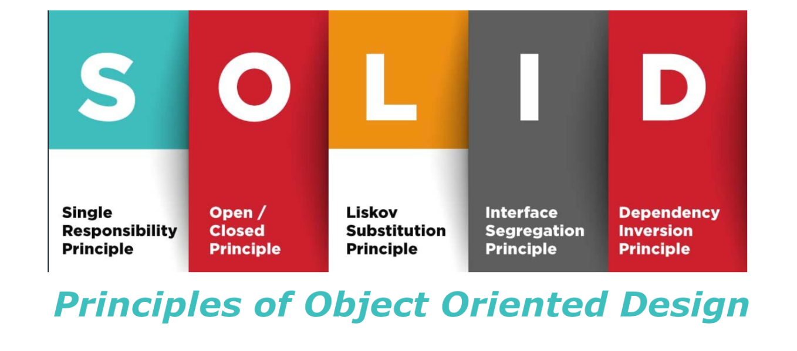

- Propuesta por **Robert C.Martin** en el 2000.
- Son **recomendaciones** para escribir un código **sostenible,mantenible,escalable y robusto**.
- Beneficios:  
    - Alta **Cohesión**. Colaboracion entre clases.
    - Bajo **Acoplamiento**. Evitar que una clase dependa fuertemente de otra clase.

- Principio de Responsabilidad Única: Una clase debe tener **una razón** para existir mas no para cambiar.
- Principio de Abierto/Cerrado: Las piezas del software deben estar **abiertas para la extensión** pero **cerradas para la modificación**.
- Principio de Sustitución de Liskov: Las **clases subtipos** deberían ser reemplazables por sus **clases padres**.
- Principio de Segregación de Interfaz: Varias **interfaces** funcionan **mejor que una sola**.
- Principio de Inversión de Dependencia: Clases de **alto nivel** no deben depender de las clases **bajo nivel**.

