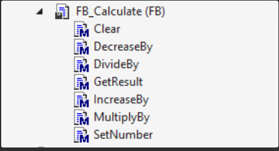

### <span style="color:grey">Interfaz Fluida:</span>
Un diseño de programación popular en lenguajes de alto nivel como C# es el llamado 'código fluido' o 'interfaz fluida'. 
Descrito en 2005 por Martin Fowler. Pero, ¿qué es una interfaz fluida y cómo implementarla en texto estructurado? nos centraremos en una implementación de una interfaz fluida en texto estructurado.

### <span style="color:grey">¿Qué es una interfaz fluida?</span>
Según wikipedia:

En ingeniería de software, una interfaz fluida es una API orientada a objetos cuyo diseño se basa en gran medida en el encadenamiento de métodos. Su objetivo es aumentar la legibilidad del código mediante la creación de un lenguaje específico de dominio (DSL). El término fue acuñado en 2005 por Eric Evans y Martin Fowler.

Un buen ejemplo de este 'encadenamiento de métodos' se puede ver con las declaraciones LINQ de C#:

```javascript
EmployeeNames = EmployeeList.Where(x=› x.Age › 65) 
                            .Select(x=› x) 
                            .Where(x=› x.YearsOfEmployment › 20) 
                            .Select(x=› x.FullName); 
```
Al encadenar continuamente los métodos, podemos construir nuestra declaración completa. ¡Es bueno saber que una interfaz fluida se usa a menudo junto con un patrón de construcción!.
Podemos pensar en la interfaz fluida como un concepto, mientras que el encadenamiento de métodos es una implementación. El objetivo del diseño fluido de la interfaz es poder aplicar múltiples propiedades a un objeto conectando los métodos con puntos **(.)** en lugar de tener que aplicar cada método individualmente.

### <span style="color:grey">¿Por qué queremos esto en texto estructurado?</span>

- por legilibilidad, mas legible
- mas simple.
- por mantenimiento
- por claridad
- por facilidad de escribir
- fácil de extender..

### <span style="color:grey">¿Cómo construimos una interfaz fluida?</span>
Al hacer que el código sea comprensible y fluido, la interfaz fluida le da la impresión de que está leyendo una oración. Para lograr este patrón de diseño, necesitaría usar **el encadenamiento de métodos**.

En esta técnica, cada método devuelve un objeto y puede encadenar todos los métodos.

- veanse los links a los que se hace referencia, veremos un ejemplo en el cual implementaremos una interface fluida para realizar operaciones matematicas...


***
### <span style="color:grey">Links Interface Fluida:</span>

- 🔗 [fluent-code, www.plccoder.com](https://www.plccoder.com/fluent-code/)

- 🔗 [fluent-interface-and-method-chaining-in-twincat-3](https://twincontrols.com/community/twincat-knowledgebase/fluent-interface-and-method-chaining-in-twincat-3/#post-278)

- 🔗 [tc3-data-logger creado con interface fluida, github.com/benhar-dev](https://github.com/benhar-dev/tc3-data-logger)