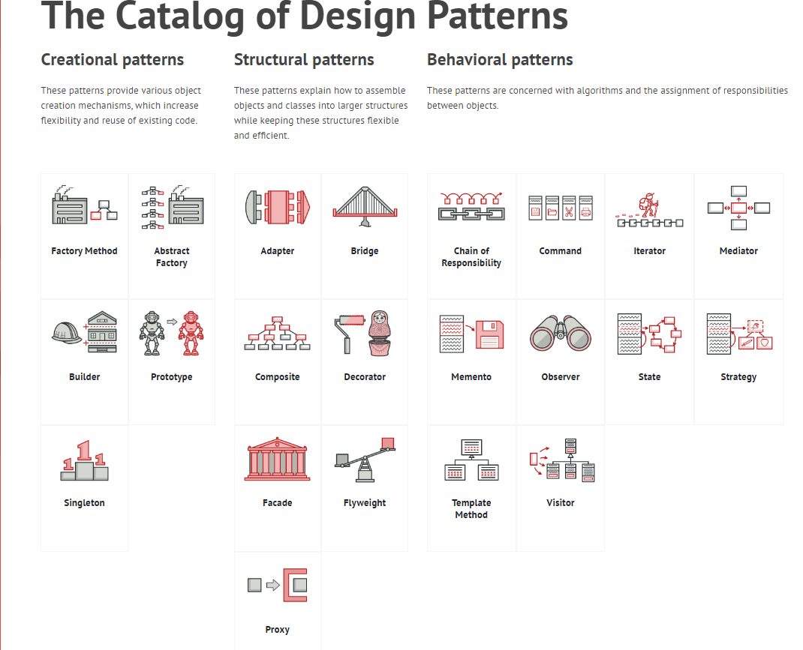

### <span style="color:grey">PATRONES DE DISEÑO:</span> 

Los patrones de diseño son soluciones generales y reutilizables para problemas comunes que se encuentran en la programación de software. En la programación orientada a objetos, existen muchos patrones de diseño que se pueden aplicar para mejorar la modularidad, la flexibilidad y el mantenimiento del código.
Algunos ejemplos de patrones de diseño que se pueden aplicar en la programación de PLCs incluyen el patrón Singleton, el patrón Factory Method, el patrón Observer y el patrón Strategy.
Por ejemplo, el patrón Singleton se utiliza para garantizar que solo exista una instancia de una clase determinada en todo el programa. Esto puede ser útil en la programación de PLCs cuando se quiere asegurar que solo hay una instancia activa del objeto que controla un determinado proceso o dispositivo.
El patrón Factory Method se utiliza para crear instancias de objetos sin especificar explícitamente la clase concreta a instanciar. Esto puede ser útil en la programación de PLCs cuando se quiere crear objetos según las necesidades específicas del programa.
El patrón Observer se utiliza para establecer una relación uno a muchos entre objetos, de manera que cuando un objeto cambia su estado, todos los objetos relacionados son notificados automáticamente. Este patrón puede ser muy útil en la programación de PLCs para establecer relaciones entre diferentes componentes del sistema, como sensores y actuadores. El patrón Strategy se utiliza para definir un conjunto de algoritmos intercambiables, y luego encapsular cada uno como un objeto. Este patrón puede ser útil en la programación de PLCs cuando se desea cambiar dinámicamente el comportamiento del sistema según las condiciones del entorno.
En resumen, los patrones de diseño son una herramienta muy útil para mejorar la calidad del código en la programación de PLCs y se pueden aplicar con éxito en la programación orientada a objetos para PLCs.

```text
“Los patrones de diseño son 
descripciones de objetos y clases 
conectadas que se personalizan para 
resolver un problema de diseño 
general en un contexto particular”. 
- Gang of Four 
```





Clasificación según su propósito: 
Los patrones de diseño se clasificaron originalmente en tres grupos: 

- Creacionales. 
- Estructurales. 
- De comportamiento. 

Clasificación según su ámbito:

-	De clase: Basados en la herencia de clases. 
-	De objeto: Basados en la utilización dinámica de objetos. 


Patrones creacionales:

- Builder
- Singleton 
- Dependency Injection 
- Service Locator 
- Abstract Factory
- Factory Method 

Patrones estructurales:

- Adapter
- Data Access Object (DAO)  
- Query Object 
- Decorator 
- Bridge 

Patrones de comportamiento:

- Command
- Chain of Responsibility 
- Strategy
- Template Method 
- Interpreter
- Observer 
- State 
- Visitor 
- Iterator 

### <span style="color:grey">Links de Patrones de Diseño:</span>
- [IEC 61131-3: SOLID – The Interface Segregation Principle](https://stefanhenneken.net/2023/02/25/iec-61131-3-solid-the-interface-segregation-principle/#more-2505)
