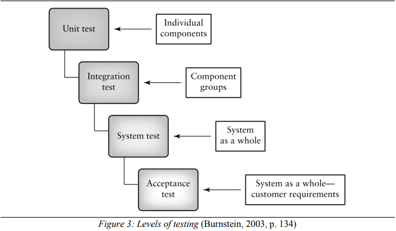

### Desarrollo Guiado por Pruebas:

La clave del TDD o Test Driven Development es que en este proceso se escriben las pruebas antes de escribir el código. Este sistema consigue no solo mejorar la calidad del software final, sino que, además, ayuda a reducir los costes de mantenimiento.

La premisa detrás del desarrollo dirigido por pruebas, según Kent Beck, es que todo el código debe ser probado y refactorizado continuamente.
Kent Beck lo expresa de esta manera: **Sencillamente, el desarrollo dirigido por pruebas tiene como objetivo eliminar el miedo en el desarrollo de aplicaciones**.

- Está creando documentación, especificaciones vivas y nunca obsoletas (es decir, documentación).
- Está (re)diseñando su código para hacerlo y mantenerlo fácilmente comprobable. Y eso lo hace limpio, sin complicaciones y fácil de entender y cambiar.
- Está creando una red de seguridad para hacer cambios con confianza.
- Notificación temprana de errores.
- Diagnóstico sencillo de los errores, ya que las pruebas identifican lo que ha fallado.

### El Ciclo y las Etapas del TDD:
El Desarrollo Dirigido por Pruebas significa pasar por tres fases. Una y otra vez.

- Fase roja: escribir una prueba.
- Fase verde: hacer que la prueba pase escribiendo el código que vigila.
- Fase azul: refactorizar.

### Niveles de Testing:

***
- El Desarrollo Guiado por Pruebas debe de empezarse a implementar lo mas temprano posible en el desarrollo del Software.
- Deben realizarse 
***
### Links Desarrollo Guiado por Pruebas:

- 🔗  [www.nimblework.com, desarrollo-dirigido-por-pruebas-tdd](https://www.nimblework.com/es/agile/desarrollo-dirigido-por-pruebas-tdd/)