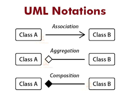

En la programación orientada a objetos, un objeto se relaciona con otro para utilizar la funcionalidad y el servicio proporcionados por ese objeto. Esta relación entre dos objetos se conoce como asociación en el diseño de software general orientado a objetos y se representa con una flecha en el Lenguaje Unificado de Modelado o UML.

### Dependencias entre Clase:
- Clases: Establecen relaciones para solucionar el problema planteado.
- Existen diferentes tipos de relaciones entre clases.

### UML Relaciones Notaciones:

Aquí hay notaciones UML para un tipo diferente de dependencia entre las dos clases.

### Clasificación según la Dependencia entre Clases:

- Agregación:
- Composición:

### ¿Qué es una relación de Asociación?
- Una relación de asociación entre dos clases es una relación **"tiene un"**. 

- Ejemplos:
  
  - Un Humano tiene corazón y sangre.(Composición)

  Por ejemplo, la clase Humano es una composición de varias partes del cuerpo, incluidas la  mano , la pierna  y el corazón y la sangre . Cuando un objeto humano muere, todas las partes de su cuerpo dejan de existir de manera significativa, este es un ejemplo de Composición.

  - Un coche tiene un motor y estructura (Agregación ó Composición)

  Un ejemplo de agregación podria ser el automóvil y sus partes, por ejemplo, motores, ruedas, etc. Las partes individuales del automóvil pueden existir cuando el automovil deja de funcionar.
  Este ejemplo se podria confundir visto desde otra perpectiva podria ser composición el automóvil y sus partes. Las partes individuales del automóvil no pueden funcionar cuando se destruye..

  Otro ejemplo, incluir objetos que pueden existir sin ser parte del objeto principal como un Jugador que es parte de un Equipo, puede existir sin un equipo y también puede formar parte de otros equipos.

  - Un libro tiene Paginas.

### Dependencia entre Clases por Agregación:
- Relación débil entre clases.
- A un todo se le agregran componentes.
- El todo puede existir aunque no existan sus componentes.
- Los componentes pueden pertenecer a otros todos.
- Representación en UML:
    - Se representa por un rombo blanco ó sin relleno.

### Dependencia entre Clases por Composición:
- Relación estrecha entre clases.
- Componentes forman un todo.
- Todo formado por sus componentes. Si todo se elemina, también se eliminan sus componentes.
- La dependencia entre clases por composición se consigue añadiendo dentro de una clase otra clase en la zona de declaracion de variables (**VAR END_VAR**)
- Representación en UML: 
    - Se representa por un rombo negro ó con relleno.
- La composición es una relación como la agregación, pero más fuerte, es decir, un objeto no puede ser ese objeto sin otros objetos, por ejemplo: una silla no puede ser silla sin sus patas, un automóvil no puede ser automóvil sin sus ruedas o su motor, básicamente todos dependen de entre sí.
     
### Diferencias entre Asociación, Agregación y composición:
Tanto la Composición como la Agregación son formas de asociación entre dos objetos, pero existe una diferencia sutil entre composición y agregación , que también se refleja en su notación UML. Nos referimos a la asociación entre dos objetos como Composición  cuando una clase posee otras clases y otras clases no pueden existir de manera significativa, cuando el propietario es destruido.

Los programadores a menudo confunden entre Asociación, Composición y Agregación en las discusiones sobre diseño orientado a objetos; esta confusión también hace que la diferencia entre Asociación, Composición y Agregación sea  una de las preguntas populares..., solo después de la diferencia entre clase abstracta e interfaz.

La composición es más fuerte que la agregación. En resumen, una relación entre dos objetos se denomina asociación, y una asociación se conoce como composición cuando un objeto posee a otro, mientras que una asociación se conoce como agregación cuando un objeto usa otro objeto.

los tres denotan una relación entre objetos y solo difieren en su fuerza, también puedes verlos como se muestra a continuación, donde la composición representa la forma más fuerte de relación y la asociación es la forma más general.

### Niveles de dependencia entre clases:
- 1 (relación uno y solo uno)
- 1..1 (relación uno a uno)
- 0..1 (relación de cero a uno)
- M..N (relación de M hasta N)
- M,N (relación M ó N)
- *(relación de cero a muchos)
- 1..* (relación de uno a muchos y al menos uno)

### Vamos a ver 2 tipos de relaciones:

- Asociación.
    - De uno a uno: Una clase mantiene una **asociación de a uno** con otra clase.
    - De uno a muchos: Una clase mantiene una asociación con otra clase **a través de una colección**.
    - De muchos a muchos: La **asociación se da en ambos lados** a través de una colección.
- Colaboración.
    - La colaboración se da **a través de una referencia de una clase** con el fin de **lograr un cometido**.

***
### Links UML Relaciones:
- 🔗 [Relación agregación y composición en Java](https://www.arkanapp.com/post.php?id=19#:~:text=La%20composici%C3%B3n%20es%20una%20relaci%C3%B3n,todos%20dependen%20de%20entre%20s%C3%AD.)
- 🔗 [Mensajes, agregación y clases abstractas en OOPS.](https://www.geeksforgeeks.org/messages-aggregation-and-abstract-classes-in-oops/)
- 🔗 [Diferencia entre Asociación, Composición y Agregación en Java, UML y Programación Orientada a Objetos](https://javarevisited.blogspot.com/2014/02/ifference-between-association-vs-composition-vs-aggregation.html#ixzz8Gs4zwEpe)
- 🔗 [Los 5 mejores libros y cursos de UML para que programadores de Java aprendan diseño de software en 2023](https://medium.com/javarevisited/5-best-uml-books-and-courses-for-java-programmers-13c551a9235d)
***
### Link al Video de Youtube_31:
- 🔗 [031 - OOP IEC 61131-3 PLC -- UML - Diagrama de Clases - Relaciones]()