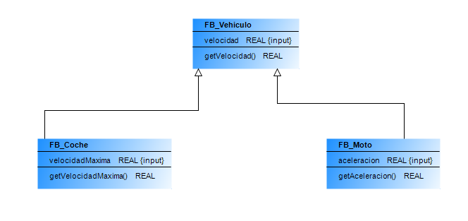

### <span style="color:grey"> Principio de Abierto/Cerrado --  (Open/Closed Principle) OCP :</span>

### <span style="color:grey">La definición del principio abierto/cerrado:</span>
El Principio Abierto/Cerrado (OCP) fue formulado por Bertrand Meyer en 1988 y establece:

Una entidad de software debe estar **abierta a extensiones**, pero al mismo tiempo **cerrada a modificaciones**.
Entidad de software: Esto significa una clase, bloque de función, módulo, método, servicio, etc...

**Abierto:** el comportamiento de los módulos de software debe ser extensible.

**Cerrado:** la capacidad de expansión no debe lograrse cambiando el software existente.

Cuando Bertrand Meyer definió el Principio Abierto/Cerrado (OCP) a fines de la década de 1980, la atención se centró en el lenguaje de programación C++. Usaba herencia, bien conocida en el mundo orientado a objetos. La disciplina de la orientación a objetos, que aún era joven en ese momento, prometía grandes mejoras en la reutilización y la mantenibilidad al permitir que clases concretas se usaran como clases base para nuevas clases.

Cuando Robert C. Martin se hizo cargo del principio de Bertrand Meyer en la década de 1990, lo implementó técnicamente de manera diferente. C ++ permite el uso de herencia múltiple, mientras que la herencia múltiple rara vez se encuentra en los lenguajes de programación más nuevos. Por este motivo, Robert C. Martin se centró en el uso de interfaces. Se puede encontrar más información al respecto en el libro (enlace publicitario de Amazon *) [Arquitectura limpia: el manual práctico para el diseño de software profesional.](https://www.amazon.de/gp/product/395845724X/ref=as_li_tl?ie=UTF8&camp=1638&creative=6742&creativeASIN=395845724X&linkCode=as2&tag=0101e3-21&linkId=77473018891c27120a9cebe02be17c27)

### <span style="color:grey">Resumen:</span>
Sin embargo, adherirse al principio abierto/cerrado (OCP) conlleva el riesgo de un exceso de ingeniería. La opción de extensiones solo debe implementarse donde sea específicamente necesario. El software no puede diseñarse de tal manera que todas las extensiones imaginables puedan implementarse sin realizar ajustes en el código fuente.

### <span style="color:grey">Ejemplo:</span>

```javascript
FUNCTION_BLOCK Vehiculo
VAR_INPUT
    velocidad : REAL;
END_VAR

// método para obtener la velocidad
getVelocidad() : REAL;
END_FUNCTION_BLOCK

FUNCTION_BLOCK Coche EXTENDS Vehiculo // extiende la función Vehiculo
VAR_INPUT
    velocidadMaxima : REAL;
END_VAR

// método para obtener la velocidad máxima
getVelocidadMaxima() : REAL;
END_FUNCTION_BLOCK

FUNCTION_BLOCK Moto EXTENDS Vehiculo // extiende la función Vehiculo
VAR_INPUT
    aceleracion : REAL;
END_VAR

// método para obtener la aceleración
getAceleracion() : REAL;
END_FUNCTION_BLOCK
```


De esta manera, la clase "Vehiculo" está cerrada para modificaciones directas y abierta para extensiones a través de las nuevas clases "Coche" y "Moto". Cada nueva clase agrega funcionalidades específicas sin modificar directamente la clase original.
***
### <span style="color:grey">Links:</span>

- 🔗 [stefanhenneken.net, EC 61131-3: SOLID – The Open/Closed Principle](https://stefanhenneken.net/2023/04/06/iec-61131-3-solid-the-open-closed-principle/)

- 🔗 [hdeleon.net, Principios SOLID: Principio de Abierto/Cerrado OCP](https://www.youtube.com/watch?v=ViKWVjyMUwQ)

- 🔗 [El Camino Dev, El Principio Abierto Cerrado con C# | Principios SOLID](https://www.youtube.com/watch?v=D7gaQOgZ4Qs)
***
### <span style="color:grey">Link al Video de Youtube 025:</span>
- 🔗 [025 - OOP IEC 61131-3 PLC -- SOLID - OCP]()