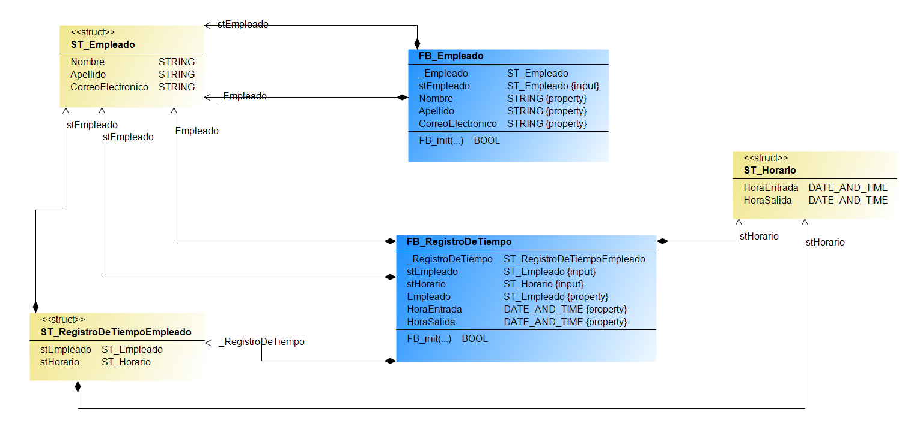

### <span style="color:grey"> Principio de Responsabilidad Única -- (Single Responsibility Principle) SRP :</span>

El principio de responsabilidad única establece que una clase debe tener una sola responsabilidad en un programa.

### <span style="color:grey"> Ejemplo :</span>
Por ejemplo, en lugar de tener una clase "Empleado" que maneje tanto la información personal como el registro de tiempo, se deben crear dos clases separadas: "Empleado" para la información personal y "RegistroDeTiempo" para el registro de tiempo. De esta manera, cada clase se enfoca en una sola tarea y es más fácil de mantener y modificar.

En lugar de tener una Clase que maneje todo, creamos dos Clases separadas:

```javascript
FUNCTION_BLOCK Empleado
VAR_INPUT
    nombre : STRING;
    apellido : STRING;
    correoElectronico : STRING;
END_VAR

// constructor
Empleado(nombre, apellido, correoElectronico);

// getters y setters
nombre();
apellido();
correoElectronico();

END_FUNCTION_BLOCK
```

```javascript
FUNCTION_BLOCK RegistroDeTiempo
VAR_INPUT
    empleado : Empleado; // instancia de la función Empleado
    horaEntrada : DATE_AND_TIME;
    horaSalida : DATE_AND_TIME;
END_VAR

// constructor
RegistroDeTiempo(empleado, horaEntrada, horaSalida);

// getters y setters
empleado();
horaEntrada();
horaSalida();

END_FUNCTION_BLOCK
```


De esta manera, la Clase "Empleado" solo maneja la información personal del empleado y la Clase "RegistroDeTiempo" solo maneja el registro de tiempo. Cada Clase tiene una sola responsabilidad y es más fácil de mantener y modificar en el futuro.

***
### <span style="color:grey">Links:</span>
- 🔗 [stefanhenneken.net,iec-61131-3-solid-the-single-responsibility-principle](https://stefanhenneken.net/2022/03/10/iec-61131-3-solid-the-single-responsibility-principle/)
***
### <span style="color:grey">Link al Video de Youtube 023:</span>
- 🔗 [023 - OOP IEC 61131-3 PLC -- SOLID - SRP]()