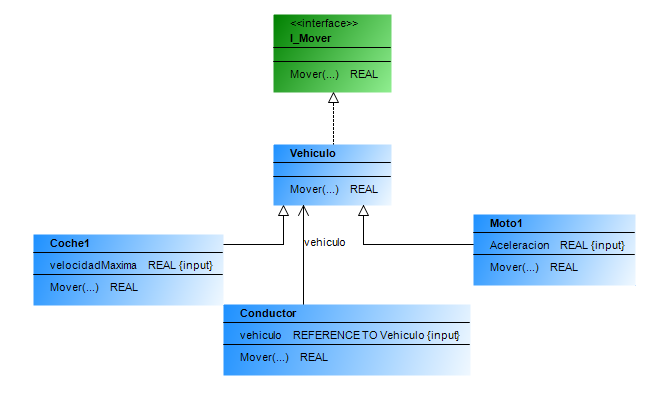

### <span style="color:grey"> Principio de Sustitución de Liskov -- (Liskov Substitution Principle) LSP :</span>

El principio de sustitución de Liskov establece que una instancia de una subclase debe poder ser utilizada en cualquier lugar donde se espera una instancia de la clase base, sin afectar el comportamiento del programa.

### <span style="color:grey">Ejemplo:</span>

```javascript
INTERFACE I_Mover
    METHODS Mover : REAL; // método para mover el vehículo
        VAR_INPUT
        Velocidad_Deseada : REAL;
        END_VAR
END_INTERFACE

FUNCTION_BLOCK Vehiculo IMPLEMENTS I_Mover
// clase base para los vehículos
VAR_INPUT
    velocidad : REAL;
END_VAR
    METHODS Mover : REAL; // método para mover el vehículo
        Mover := Velocidad_Deseada;      
END_FUNCTION_BLOCK

FUNCTION_BLOCK Coche1 EXTENDS Vehiculo
// subclase para los coches
VAR_INPUT
    velocidadMaxima : REAL;
END_VAR
   METHODS Mover : REAL; // método para mover el Coche
    Mover := Velocidad_Deseada * velocidadMaxima;   
END_FUNCTION_BLOCK

FUNCTION_BLOCK Moto1 EXTENDS Vehiculo
// subclase para las motos
VAR_INPUT
    Aceleracion : REAL;
END_VAR
    METHODS Mover : REAL; // método para mover la Moto
        Mover := Velocidad_Deseada * Aceleracion;
END_FUNCTION_BLOCK

FUNCTION_BLOCK Conductor
VAR_INPUT
    vehiculo : REFERENCE TO Vehiculo; // referencia a la clase base Vehiculo
END_VAR
    METHODS Mover : REAL; // método para mover el vehículo   
        // método para mover el vehículo a la velocidad especificada
        THIS^.vehiculo.Mover(velocidad);
END_FUNCTION_BLOCK
```


- En este ejemplo, se utiliza la subclase `Coche1` y `Moto1` como instancias de la clase base `Vehiculo`, lo que cumple con el principio de sustitución de Liskov. Esto significa que se puede utilizar cualquier instancia de `Coche1` o `Moto1` donde se espera una instancia de `Vehiculo`, sin afectar el comportamiento del programa.

- Además, cada subclase tiene un método `Mover` que se utiliza para mover el vehículo, lo que demuestra cómo se puede utilizar la misma interfaz `I_Mover` (el mismo nombre de método) para diferentes implementaciones concretas, mediante la sobreescritura del metodo mover que tiene la clase `Vehiculo`.
***
### <span style="color:grey">Links:</span>

- 🔗 [stefanhenneken.net,iec-61131-3-solid-the-liskov-substitution-principle](https://stefanhenneken.net/2022/09/27/iec-61131-3-solid-the-liskov-substitution-principle/)

- 🔗 [hdeleon.net, Principios SOLID: Principio de Sustitución de Liskov LSP](https://www.youtube.com/watch?v=JwtpU_rH1LE)

- 🔗 [
makigas: aprende a programar, SOLID: Principio de Sustitución de Liskov (LSP)](https://www.youtube.com/watch?v=JQX7wrCzxFA&list=PLTd5ehIj0goO1JFIfukh3UtU9e0BeFM9K&index=3)
***
### <span style="color:grey">Link al Video de Youtube 026:</span>
- 🔗 [026 - OOP IEC 61131-3 PLC -- SOLID - LSP](https://youtu.be/tnghQbIPHs0)